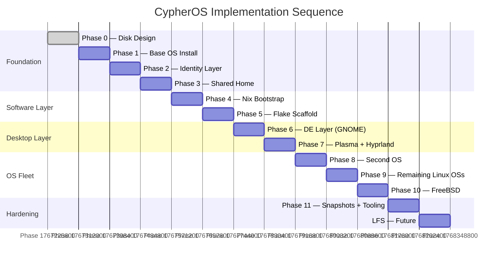

# Roadmap

This document tracks the implementation sequence and pending work across all phases of CypherOS. Each phase is designed to be fully functional before the next begins.

For the reasoning behind the phase ordering, see the [2026-04-15 Migration Journal Entry](https://claude.ai/chat/docs/development/journal/2026-04-15-nixos-migration.md).

---

## Implementation Phases

| Phase | Name              | Status  | Description                                                                 |
| ----- | ----------------- | ------- | --------------------------------------------------------------------------- |
| 0     | Disk Design       | ✅ Done  | Subvolume layout, partition scheme, mount points finalized on paper         |
| 1     | Base OS Install   | ✅ Done  | Install base OS; create all BTRFS subvolumes                                |
| 2     | Identity Layer    | Pending | `@identity` subvol, `libnss-extrausers`, verify `cypher-whisperer` resolves |
| 3     | Shared Home       | ✅ Done  | Mount `@home`, verify file ownership via UID 1000                           |
| 4     | Nix Bootstrap     | ✅ Done  | Install Nix daemon (multi-user), shared `@nix-store`, Home Manager          |
| 5     | Flake Scaffold    | ✅ Done  | Initialize `CypherOS` repo, declare user and common packages                |
| 6     | DE Layer          | ✅ Done  | GNOME as HM module, XDG profile launchers, verify isolation                 |
| 7     | Plasma + Hyprland | Pending | KDE Plasma + Hyprland as HM modules; HyDE/HydeNix decoupling                |
| 8     | Second OS         | Pending | Install secondary OS via bootstrap tools; shared subvol mounts; HM apply    |
| 9     | Remaining OSs     | Pending | Repeat Phase 8 pattern for remaining Linux OSs                              |
| 10    | FreeBSD           | Pending | Home access strategy, `vipw`, Nix bootstrap                                 |
| 11    | Hardening         | Pending | Snapshots (btrbk/snapper), boot fallback, identity sync tooling             |
| LFS   | Future            | Future  | Manual passwd entry, Nix from source, mount shared subvols                  |

---

## Pending Work — By Horizon

### Immediate — Incremental Wiring

_The namespace is designed and the pattern is understood. The remaining work is wiring existing modules into the `cypher-os` namespace incrementally._

- [x] Wrap each module in `modules/apps/` with `lib.mkIf config.cypher-os.apps.enable`
- [x] Declare `cypher-os.apps.browsers.enable`, `terminals.enable`, `editors.enable`, etc. in their respective modules
- [x] Wire `modules/common/` toggleable items (dev, cli, proton, productivity) into `cypher-os.apps.*`
- [x] Move always-on common items (fonts, xdg, security) to unconditional imports

---

### Medium Term — DE Expansion & Polish

- [ ] **Documentation** — Meticulous documentation throughout the repository; from the general project level down to module level, ensuring everything is captured and consistent.
- [ ] **`cypher-ide` deployment** — Polish deployment strategy (currently assumes `~/CYPHER_OS/configs/editor/cypher-ide`).
- [ ] **Security module** — Move `security.nix` from `modules/apps/common` to `modules/` with a dedicated `cypher-os.security` namespace. Learn and extend security hardening progressively (firewalls, VPNs, proxies, DNS).
- [ ] **`burn-my-windows`** — Noticed `~/.config/burn-my-windows` exists manually. Incorporate via `home.file` or `home.activation` for reproducibility on fresh installs.
- [ ] **Assertions** — Bring in Nix assertions to polish the options and namespace (runtime validation guards to complement `lib.mkIf` conditional inclusion).
- [ ] **Code isolation** — Throughout the repo, there are code blocks in other languages defined as strings within Nix code. Investigate and implement a pattern to isolate them into their own files while still having Nix consume them correctly.
- [ ] **Server profile guards** — Add server profile guards on modules that should not activate in a server context (e.g. devops modules).
- [ ] **Theming** — Fix the inconsistent Catppuccin theme (some apps like LibreOffice are broken in relation to theme). Polish the theming strategy to be consistent end-to-end.
- [ ] **Path assumptions** — Some configurations hard-assume `/home/cypher-whisperer/DATA/` and `/home/cypher-whisperer/CYPHER_OS`. Safe on rebuild, but on a fresh install these paths may not be mounted yet (e.g. Neovim). Resolve gracefully.
- [ ] **`modules/de/plasma/`** — Implement following the gnome module pattern.
- [ ] **`modules/de/hyprland/`** — Implement following the documented architecture.
- [ ] **DE launcher `.desktop` entries** — Register all DE launcher scripts as GDM session `.desktop` entries.
- [ ] **`modules/dm/sddm`** — Wire `sddm` as an option alongside `gdm`.

---

### Longer Term — CypherOS Full Vision

- [ ] **Secrets management** — Embrace a secrets management strategy for configurations that require privacy and security (hinted in `modules/devops/secrets.nix`). Candidates: `sops-nix`, `agenix`.
- [ ] **Merge `nixos-gnome` host** — Phase 9: merge into the canonical `hosts/nixos/` configuration.
- [ ] **Multi-boot** — `systemd-boot` replacing GRUB; each OS with its own loader entry on the shared ESP.
- [ ] **Non-NixOS hosts** — Wire Arch, Fedora, Debian home configs using `homeConfigurations` in `flake.nix`.
- [ ] **Server profile** — Implement `cypher-os.profile.server.enable` with a hardened minimal config.
- [ ] **Decouple `cypher-whisperer`** — Currently hard-coded throughout the setup. Modularize and isolate the user concern so the system is not tied to a specific username.
- [ ] **Hardening** — `users.mutableUsers = false`, reviewed firewall rules, secrets management via `sops-nix`.

---

## Phase 11+ Automation Targets

As the system matures, the natural automation layer emerges from the patterns already established:

|Script|Purpose|
|---|---|
|`add-os.sh`|Mount new OS root subvolume, write `fstab` entries, wire identity layer, apply HM|
|`add-user.sh`|Add entry to `@identity`, create home directory, wire into setup|
|`sync-identity.sh`|Propagate password changes across OSs (critical for FreeBSD)|
|`snapshot.sh`|BTRFS snapshot wrapper (btrbk or snapper)|
|`cypher-os-install.sh`|Master install — one command, full machine from scratch|

The master install script is the capstone of Phase 11. Once the system is manually proven, it gets codified. At that point, reprovisioning the entire machine from scratch is a single command.
