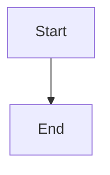
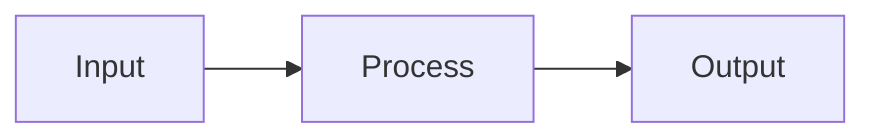
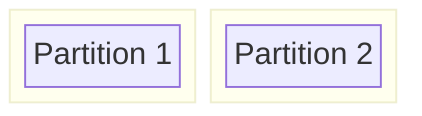
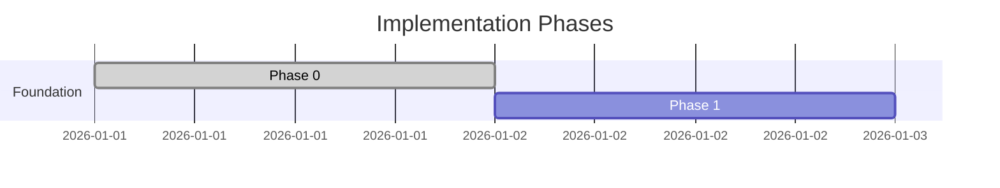
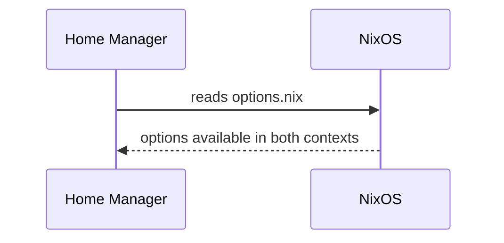

# Diagramming Convention

All diagrams in CypherOS documentation are written in **Mermaid**. No ASCII art, no image files for diagrams that can be expressed as code.

---

## Why Mermaid

- Mermaid is plain text — _it lives in Markdown files, diffs cleanly in git, and is reviewed the same way code is._
- GitHub renders Mermaid natively in `.md` files. No tooling setup required to view diagrams.
- Diagrams stay in sync with the documentation that surrounds them — _no separate asset files to maintain._
- Mermaid is version-controllable. When an architecture changes, the diagram changes in the same commit.

---

## How to Embed a Diagram

Wrap the Mermaid code in a fenced code block with the `mermaid` language tag:

````md

````

That's it. GitHub, Obsidian, and most modern Markdown renderers handle the rest.

---

## Diagram Types — When to Use Which

### `flowchart` — Processes, data flow, decision trees

Use when showing how something moves, transforms, or routes.



**Use for:** Module evaluation graphs, install sequences, swap hierarchy, cascade flows.

---

### `block-beta` — Physical structure, partitions, containers

Use when showing spatial layout or containment relationships. Good for disk layouts.



**Use for:** Disk partition layout, BTRFS subvolume structure.

---

### `gantt` — Timelines, phase sequences

Use when showing phases over time or ordered implementation sequences.



**Use for:** Roadmap phases, implementation sequences.

---

### `sequenceDiagram` — Message passing, protocol flows

Use when showing interactions between components over time.



**Use for:** Nix evaluation sequences, flake input flows, authentication flows.

---

### `classDiagram` — Data structures, option trees

Use when showing relationships between types or structured data.

**Use for:** Option namespace trees (though `flowchart` often works better for these).

---

## Conventions

- **Keep diagrams close to the text that explains them.** A diagram without surrounding prose is confusing. A diagram that duplicates its prose is redundant. Prose introduces; the diagram crystallizes.
- **Label nodes descriptively.** Use `["Label text"]` syntax for nodes — unquoted labels break on special characters.
- **Use `subgraph` to group related nodes** in `flowchart` diagrams when the grouping aids understanding.
- **Prefer `LR` (left-right) for namespace and hierarchy diagrams.** Prefer `TD` (top-down) for process and cascade diagrams.
- **Don't over-diagram.** A diagram earns its place when it conveys something that prose cannot — spatial relationships, data flow, sequential structure. A table is often better than a diagram for simple comparisons.

---

## Obsidian

Obsidian supports Mermaid rendering natively. The same `.md` files work in the vault and on GitHub without modification.
