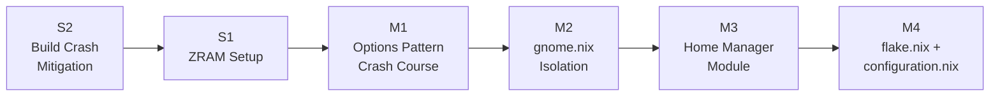

# 2026-04-15 — NixOS Migration Session

**Type:** Development Session
**Author:** CypherWhisperer
**Duration:** Multi-hour session spanning 2026-04-15 into 2026-04-16

---

## What This Session Was

This was the session that brought the CypherOS NixOS configuration from a functional-but-monolithic state to a properly modular, namespace-driven architecture. It was a deliberate and methodical session: understand the system deeply first, implement second.

The session had two categories of work — **system setup concerns** (things that needed fixing for the machine to be a stable development environment) and **migration concerns** (the structural refactor that makes the configuration scalable going forward). The order of attack mattered: fixing the environment first, then doing the architecture work.

---

## Order of Attack

**Why this order:**

S2 (build crashes) came first because a machine that crashes mid-rebuild cannot be used to test any subsequent changes. No point implementing the options pattern if `nixos-rebuild switch` takes the terminal down halfway through applying it. S1 (ZRAM) is low-risk and additive — it went in right after S2 while swap was already being touched.

M1 (options crash course) came before the refactor because M2/M3/M4 are all applications of the options pattern. Understanding the _why_ behind the refactored module structure — `config` vs `options` separation, `lib.mkOption`, `lib.mkIf`, `lib.mkDefault`, the `options.*`/`config.*` split inside a module, nested namespaces like `cypher-os.de.gnome.enable` — is what makes the rest legible rather than just mechanical.

M2, M3, and M4 were tackled together because they're tightly coupled. Isolating `gnome.nix` (M2) requires the options pattern from M1. The new Home Manager module structure (M3) is what `gnome.nix`'s old import responsibilities move into. And both feed directly into the `flake.nix` and `configuration.nix` updates (M4).

---

## System Setup Concerns

### S2 — Build Crash Mitigation

The most immediately painful concern. The crash was a known failure mode: `nixos-unstable` + source builds of heavy packages (`terraform`, `vault`, `n8n`) + constrained RAM (8GB, GNOME consuming ~2GB baseline) + **no effective swap** = OOM killer fires, GNOME crash reporter, dead terminal.

The root causes were: the binary cache lags the unstable channel by hours to days (so recently-built packages have no substitute yet); Nix defaults to `auto` parallelism (one job per CPU core = 8 on the i7-7th gen); and the `@swap` swapfile that existed on disk was never activated in NixOS — `swapDevices` was empty in `hardware-configuration.nix`.

The response was two axes applied simultaneously:

1. **Resource ceiling** — `max-jobs = 2`, `cores = 2`, `daemonCPUSchedPolicy = "idle"`, `daemonIOSchedClass = "idle"`. At most 4 cores in use for builds, leaving 4 cores for the DE. The daemon schedules at idle priority for both CPU and disk.

2. **Substitute-or-fail** — `fallback = false` in `nix.settings`. Rather than silently falling into a RAM-crushing source build on a cache miss, Nix now errors with a clear message identifying which package has no substitute. Explicit `--option fallback true` required to permit a source build.

Full details in [INC-2026-04-15-001](../../incidents/INC-2026-04-15-001.md).

### S1 — ZRAM Setup

With swap being addressed, ZRAM was the natural companion. The `@swap` swapfile is the disk-backed last resort — slow, avoidable. ZRAM creates a compressed in-memory swap device that sits in front of the disk in the kernel's priority hierarchy. Memory pressure hits ZRAM first; the disk swapfile only if ZRAM fills.

At 50% RAM allocation with `zstd` compression (2:1 to 3:1 ratio), the 4GB ZRAM input gives approximately 8–12GB of effective swap headroom before the disk is touched.

Full details in [ADR-004](../../project/decisions/ADR-004-zram-setup.md).

---

## Migration Concerns

### M1 — The NixOS Options Pattern

Before writing a single line of the refactor, the session went deep on NixOS's options system. This is not just a design pattern — it is the foundational mechanism that makes everything else in the migration coherent.

The critical distinctions:

- **`options.*` vs `config.*` inside a module** — you're not just setting values, you're _declaring typed options_ that modules then _implement_. These live in separate attribute sets within the same module file (or in separate files as we do here).
- **`lib.mkOption` vs `lib.mkEnableOption`** — `mkEnableOption` is a one-liner convenience for boolean toggle options, defaulting to `false`. `mkOption` gives full control over type, default, description.
- **`lib.mkIf`** — applies a config block conditionally based on an option's value. The mechanism for the kill-switch pattern.
- **`lib.mkDefault`** — sets a value at low priority. Explicit assignments in host configs always win. This is what makes the profile meta-switch work cleanly: the profile sets sensible defaults, the host overrides precisely.
- **Nested namespaces** — `cypher-os.de.gnome.enable` is just a nested attribute path. The dot notation is Nix attribute set syntax. `options.cypher-os.de.gnome.enable = lib.mkEnableOption "...";` declares it.

Understanding this unlocks the reasoning behind every subsequent structural decision. See [ADR-001](../../project/decisions/ADR-001-cypher-os-namespace-design.md) for the namespace design that came out of this understanding.

### M2 — `gnome.nix` Isolation + DE Toggle Pattern

The original `gnome.nix` was the de-facto Home Manager entry point. It imported `../apps`, `../gaming`, `../common`, held `home.stateVersion`, and contained all GNOME-specific config in the same file. One file touching three entirely separate concerns.

The refactor separated these responsibilities cleanly:

- `modules/de/gnome/{default,options,hm,system}.nix` — purely GNOME-concerned
- `modules/home/default.nix` — new HM root, owns the imports and `home.stateVersion`
- `cypher-os.de.gnome.enable` wired as a real option in the namespace

This naturally opened the path for Plasma and Hyprland as siblings — they now have a clear, consistent pattern to follow. Full details in [ADR-002](../../project/decisions/ADR-002-gnome-module-isolation.md).

The deeper layering problem — NixOS and HM running in separate evaluation contexts, sharing the same option namespace — was surfaced here and resolved into the three-file split convention formalized in M4.

### M3 — Home Manager Module

The HM module was originally embedded inline in `flake.nix`. Extracting it into `modules/home/default.nix` makes it a proper NixOS module with its own clearly-owned responsibilities. It unconditionally imports every module group that declares `cypher-os.*` options — this is what makes all options available to HM before any `lib.mkIf` fires.

The rule: every module imported by `modules/home/default.nix` must resolve to a `default.nix` that is a pure shim — `options.nix` + optional `hm.nix`. No system config, no `environment.*`, no `services.*` in the HM import chain.

### M4 — Three-File Split Convention + `flake.nix` / `configuration.nix` Updates

The architecture decision that generalizes the GNOME isolation pattern into a system-wide convention. Every module group that touches both HM and NixOS follows: `options.nix` (declarations only), `hm.nix` (HM config), `system.nix` (NixOS config), `default.nix` (HM shim).

The four invariants that hold everywhere:

1. Options are declared once, in `options.nix`.
2. `system.nix` always imports `./options.nix`.
3. `default.nix` never contains NixOS-only attributes.
4. Inner modules always check both parent and self in their `lib.mkIf` guard.

`flake.nix` changes were minimal — two lines pointing to the new HM entry point. `configuration.nix` gained the profile module import and replaced verbose option lines with `cypher-os.profile.desktop.enable = true`.

Full details in [ADR-005](../../project/decisions/ADR-005-module-architecture.md).

---

## Milestone Status

| Item | Status | Notes |
|---|---|---|
| S2 — Build Crash Mitigation | ✅ Done | `nix.settings` ceiling + `fallback = false` + swap activation |
| S1 — ZRAM Setup | ✅ Done | `zramSwap` with `zstd`, 50% RAM, disk swap as fallback |
| M1 — Options Pattern | ✅ Done | `options`/`config` split, `mkEnableOption`, `mkIf`, `mkDefault` |
| M2 — `gnome.nix` Isolation | ✅ Done | Three-file split, `cypher-os` namespace wired |
| M3 — Home Manager Module | ✅ Done | `modules/home/default.nix`, `cypher-os.apps.enable` declared |
| M4 — `flake.nix` + `configuration.nix` | ✅ Done | New entry point, profile meta-switch, host config cleaned up |

---

## Repository Conventions Established This Session

These are now standing conventions for all future development on CypherOS:

- **Hostname** — `nixos-gnome` retired. Host is now `hosts/nixos/`. Rebuild target: `--flake .#cypher-nixos`.
- **`default.nix` = HM territory.** Imported directly or indirectly by `modules/home/default.nix`. Exposes declarations to HM at evaluation time.
- **`system.nix` = NixOS territory.** Imported directly or indirectly by `hosts/nixos/configuration.nix`. Exposes declarations to NixOS at evaluation time.
- **`options.nix` = single source of truth for option declarations.** One place, one file, imported by both contexts.
- **`lib.mkDefault` in profile modules, explicit assignment in host configs.** The profile sets sensible defaults; the host overrides precisely.
- **`hardware-configuration.nix` is never manually edited.** It is machine-generated output.
- **`home.stateVersion` lives in `modules/home/default.nix`, set once, never changed.**
- **Inline comments are first-class.** Modules are self-documenting. A comment in a module file is documentation.

---

## What Comes Next

The immediate pending work is incremental wiring — wrapping existing `modules/apps/` in the `cypher-os.apps.*` namespace, wiring `modules/common/` toggleable items, moving always-on items to unconditional imports. Beyond that, the medium and longer-term roadmap is tracked in [`ROADMAP.md`](../../../ROADMAP.md).
