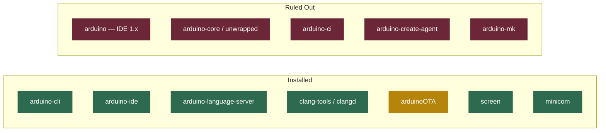

# [2026-05-16] IoT / Arduino Development Environment — CypherOS Integration

<!-- The journal is informal. This is the human layer on top of git history. Write like you're explaining the session to yourself six months from now. What happened, what you figured out, what you're still unsure about. No polish required. Honest > polished. -->

**Date:** 2026-05-16
**Duration:** ~3 hours
**Repos touched:** CYPHER_OS · CYPHER_IDE
**Phase:** Infrastructure / Tooling Expansion

---

## What I Worked On

- Bootstrapped a full IoT / Arduino development environment inside CypherOS,
- integrated across three IDEs (Arduino IDE 2, Neovim/CypherIDE, VSCode) and
- wired into the existing NixOS module architecture.
- The trigger was an upcoming university IoT course. The goal was not just to get Arduino working, but to do it in a way that's declarative, reproducible, and consistent with existing CypherOS conventions — _three-file module split, SSOT for options, no concern leakage across modules_.

---

## What Got Done

1. **`modules/arduino/options.nix`**:
	- declared the `cypher-os.arduino.*` option group: `enable`, `ide.enable`, `ota.enable`, and `fqbn` (board FQBN string, propagated to LSP and ZSH aliases as a single source of truth)

2. **`modules/arduino/default.nix`**:
	- router exposing `options.nix` and `hm.nix` to the HM profile; `system.nix` wired separately from `configuration.nix` per convention

3. **`modules/arduino/system.nix`**:
	- NixOS-context config: system packages (`arduino-cli`, conditionally `arduino-ide` and `arduinoOTA`), udev rules via `services.udev.packages`, and `dialout`/`uucp`/`lock` group membership for serial port access

4. **`modules/arduino/hm.nix`**:
	- Home Manager config: user packages (`arduino-cli`, `arduino-language-server`, `clang-tools`, `screen`, `minicom`), declarative `arduino-cli.yaml` via `xdg.configFile`, and inline notes for CypherIDE and VSCode integration

5. **`modules/shell/zsh.nix`**:
	- added Arduino aliases block via `lib.optionalAttrs config.cypher-os.arduino.enable { ... }` merged with `//` into the existing `shellAliases` attrset; FQBN interpolated directly from `config.cypher-os.arduino.fqbn`

6. **`modules/apps/editor/vscode.nix`**:
	- added Arduino Community Edition extension (`vscMkt.vscode-arduino.vscode-arduino-community`) and Arduino-specific settings block in `sharedSettings`

7. **`lsp-config.lua` (CypherIDE)**:
	- wired `arduino_language_server` via `vim.lsp.config()` with Nix-resolved binary paths (`vim.fn.exepath()`), filetype registration for `.ino`, and a comment in `mason-tool-installer` explaining why the server is intentionally absent from Mason's `ensure_installed`


---

## Key Decisions Made

### Three-IDE strategy — all backed by one `arduino-cli`

Chose to support all three IDEs simultaneously rather than picking one. The key insight is that `arduino-cli` is the universal backend — board cores and libraries installed once are available to all three. The IDEs are just different front-ends to the same toolchain.

```mermaid
graph TD
    subgraph IDE Layer
        A[Arduino IDE 2]
        B[CypherIDE / Neovim]
        C[VSCode]
    end

    subgraph Backend
        D[arduino-cli]
        E[arduino-language-server]
        F[clangd]
    end

    subgraph Hardware
        G[/dev/ttyACM0 or /dev/ttyUSB0]
        H[Physical Board]
    end

    A -- compile / upload / monitor --> D
    B -- LSP cmd args --> E
    C -- extension delegates --> D
    E -- board queries --> D
    E -- C++ indexing --> F
    D -- avrdude / esptool --> G
    G --> H
```

Each IDE's role:

| IDE                  | Primary Role                                                                     | When to Reach For It                                       |
| -------------------- | -------------------------------------------------------------------------------- | ---------------------------------------------------------- |
| Arduino IDE 2        | Board/library manager GUI, Serial Monitor with timestamps, uni lab compatibility | First-time board setup, exam submissions, library browsing |
| CypherIDE (_Neovim_) | Full LSP (completions, go-to-def, hover docs), home turf                         | Day-to-day sketch writing and editing                      |
| VSCode               | Extension ecosystem, Git integration, pair work                                  | Coursework involving diagrams or screen sharing            |

---

### Package selection — what was ruled out and why

Several packages showed up in the NixOS search and needed deliberate decisions:



|Package|Decision|Reason|
|---|---|---|
|`arduino` (IDE 1.x)|❌ Skip|Superseded by `arduino-ide` (2.x). Legacy Java GUI.|
|`arduino-core` / `arduino-core-unwrapped`|❌ Skip|Internal derivation dependency. Not consumed directly.|
|`arduino-ci`|❌ Skip|CI test runner for library authors. Irrelevant for coursework.|
|`arduino-create-agent`|❌ Skip|Browser-to-board bridge for Arduino Cloud. Privacy concern, not needed.|
|`arduino-mk`|❌ Skip|Makefile build system. `arduino-cli` covers the same ground better.|
|`arduinoOTA`|⚠️ Conditional|OTA uploads for ESP8266/ESP32 WiFi boards. Disabled until course reaches WiFi units.|

---

### `services.udev.packages` over `services.udev.extraRules`

There is a known NixOS regression where rules written via `services.udev.extraRules` land in `99-local.rules`. The `99` priority number is too late for `TAG+="uaccess"` to take effect, causing silent permission failures on USB serial devices even when the user is in the `dialout` group. Using `services.udev.packages = [ pkgs.arduino-cli ]` lets the package's own rule file ship at its correct priority (typically `60-*`), sidestepping the regression entirely.

---

### `arduino-language-server` — Nix-managed, not Mason

On NixOS, Mason downloads pre-compiled binaries with hardcoded glibc paths (`/lib64/ld-linux-x86-64.so.2`) that don't exist at the NixOS root filesystem level. `arduino-language-server` also requires two other binaries (`arduino-cli` and `clangd`) to be co-located and in PATH at startup — Mason can't guarantee that coherence across Nix-managed and Mason-managed tools. All three binaries are installed via `hm.nix` and resolved in `lsp-config.lua` via `vim.fn.exepath()`, which walks the actual Nix store PATH rather than assuming fixed locations.

The `mason-tool-installer` `ensure_installed` list has a comment explicitly documenting this so it's never accidentally added there.

---

### VSCode extension — publisher correction

The initial assumption was `vscMkt.vscjava.vscode-arduino`. This was wrong. The correct attribute is:

```nix
vscMkt.vscode-arduino.vscode-arduino-community
```

The publisher is `vscode-arduino` (the community GitHub org that forked the project after Microsoft deprecated and removed the original extension from the marketplace on October 1, 2024). The `nix-vscode-extensions` naming convention maps directly to the marketplace `publisher.extensionName` pair — both lowercased with hyphens preserved.

---

### `fqbn` as the single source of truth

The board's Fully Qualified Board Name (`arduino:avr:uno` by default) is declared once in `options.nix` under `cypher-os.arduino.fqbn`. It propagates to:

- `arduino-language-server` cmd args (via `lsp-config.lua`, manually kept in sync with a comment)
- ZSH `ard-build` and `ard-upload` aliases (via `lib.optionalAttrs` interpolation in `zsh.nix`)
- `arduino-cli.yaml` sketch defaults (implicitly, through core installs)

Changing boards mid-course means updating one option value and rebuilding. The LSP requires `:LspRestart` in any open `.ino` buffers after the rebuild.

---

## Where I Got Stuck

1. **VSCode extension publisher name.**:
	- `vscjava` was a wrong assumption — had to verify against the actual marketplace URL.
	- The marketplace URL structure (`marketplace.visualstudio.com/items?itemName=<publisher>.<name>`) is the ground truth for deriving `nix-vscode-extensions` attribute paths. Always check there first.

2. **`arduino-language-server` Mason exclusion.**:
	- The instinct was to add it to `ensure_installed` like every other LSP server.
	- The NixOS binary patching incompatibility isn't obvious unless you've already hit it with another native binary.
	- The fix is straightforward once understood, but the documentation of _why_ it's excluded is important so it doesn't get "fixed" back in later.

---

## What I Learned

1. **The FHS problem is real but contained.**:
	- NixOS's non-standard filesystem layout breaks pre-compiled binaries, but the scope is manageable: Go binaries (_like `arduino-cli`_) are statically linked and unaffected.
	- Electron apps (like `arduino-ide`) are wrapped in `buildFHSEnv` by nixpkgs.
	- The only remaining concern is VSCode extensions with native `.node` addons — _and for Arduino specifically, the extension delegates native work to `arduino-cli`, so `vscode.fhs` is only needed if the serial monitor bridge exhibits linker errors_.

2. **udev rule priority is subtle and silent.**:
	- The `extraRules` vs `packages` distinction doesn't produce an error — it just silently fails to grant `uaccess` on the device, which manifests as a `permission denied` on `/dev/ttyACM0` even after correctly adding the user to `dialout`.
	- The failure mode is indistinguishable from a missing group membership, which makes it hard to debug without knowing the regression exists.

3. **Board toolchains cannot be Nix-ified trivially.**:
	- The `arduino-nix` community project exists for this (pinning each core as a fixed-output derivation), but it requires per-board maintenance.
	- For a university course the imperative `arduino-cli core install` approach is the right pragmatic call — it's one command, not a Nix architecture problem.

4. **`sketch.yaml` is a silent LSP gate.**:
	- The language server exits silently with no error message if `sketch.yaml` is missing from the project root.
	- This will look identical to an LSP that never started, and `:LspInfo` will show no attached clients.
	- Always generate the sketch with `arduino-cli sketch new` or write the file manually before opening the `.ino` in Neovim.

---

## Open Questions

1. **ESP32 / ESP8266 cores:**
	- The course board hasn't been confirmed yet.
	- The module is ready (`ota.enable`, `additional_urls` comment in `arduino-cli.yaml`) but the board manager URLs and core installs are deferred until the course specifies hardware.

2. **`vscode.fhs` trigger:**
	- Will the Arduino Community Edition's serial monitor bridge require `vscode.fhs`? Won't know until the extension is exercised with a live board.
	- The switch is a one-liner if needed. Monitor for dynamic linker errors on first use.

3. **`arduino-language-server` false positives:**
	- Known upstream bug where built-in Arduino globals (`Serial`, `pinMode`, `digitalWrite`) are flagged as undefined by clangd's C++ indexer. Unclear whether this is fixed in the current nixpkgs version.
	- Low priority — _completions and go-to-definition for user code still work_.

4. **`arduino-nix` as a future upgrade:**
	- For a fully reproducible setup (board cores pinned as fixed-output derivations), `arduino-nix` is the right long-term path.
	- Worth revisiting after the course, if the imperative core install pattern becomes a maintenance pain point.


---

## Sketch Convention (Reference)

Every project opened in Neovim or VSCode requires this structure. The `.ino` filename must match the folder name — this is an Arduino IDE requirement, not a CypherOS one.

```
~/Projects/arduino/
└── MySketch/
    ├── MySketch.ino      ← main sketch (filename must match folder)
    ├── sketch.yaml       ← LSP board descriptor (required for Neovim LSP attach)
    └── .vscode/
        └── arduino.json  ← VSCode extension per-workspace settings (auto-generated)
```

Minimum viable `sketch.yaml`:

```yaml
default_fqbn: arduino:avr:uno   # match cypher-os.arduino.fqbn
default_port: /dev/ttyACM0      # ttyUSB0 for CH340/FTDI adapter boards
```

Generate automatically:

```bash
arduino-cli sketch new MySketch
cd ~/Projects/arduino/MySketch
nvim MySketch.ino   # LSP should attach within ~2s
```

---

## Post-Switch Checklist (First Boot)

After the first `sudo nixos-rebuild switch` and `home-manager switch` with `cypher-os.arduino.enable = true`:

```bash
# 1. Re-login or reboot for dialout group to take effect
#    (newgrp dialout for a temporary session workaround)

# 2. Update board/library index
arduino-cli core update-index

# 3. Install AVR core (Uno, Nano, Mega)
arduino-cli core install arduino:avr

# 4. Verify board detection (plug board in first)
arduino-cli board list

# 5. Verify LSP binary chain
arduino-language-server --help
clangd --version
arduino-cli version

# 6. Smoke test — create a sketch and open it
arduino-cli sketch new Blink
cd ~/Projects/arduino/Blink
nvim Blink.ino   # confirm LSP attaches (:LspInfo)
```

---

## Next Session

- Confirm course hardware (board model + FQBN) and update `cypher-os.arduino.fqbn`
- Run the post-switch checklist above against the live NixOS build
- First real sketch — Blink, then Serial.println() to confirm the full upload + monitor loop
- If VSCode serial monitor fails with a linker error, switch `package` to `pkgs.vscode.fhs`
- Revisit the documentation pass once the environment is confirmed working end-to-end

---

<!-- Commit range (fill in after session):
CYPHER_OS: [short hash] → [short hash]
CYPHER_IDE: [short hash] → [short hash]
-->
