# Architecture Overview

**Version:** 0.2.0
**Status:** Active — post-refactor
**Author:** CypherWhisperer

---

## Vision Statement

A single physical machine where multiple operating systems co-exist as bootable _lenses_ into one unified system — sharing identity, data, software, and configuration. Booting a different OS is not starting over; it is changing perspective.

→ Full design intent: [`VISION.md`](../../VISION.md)

---

## Goals

|ID|Goal|
|---|---|
|G1|**Unified Identity** — One user (`cypher-whisperer`, UID `1000`) recognised natively by every OS on the machine.|
|G2|**Shared Home** — One home directory, one set of personal data, accessible regardless of which OS is booted.|
|G3|**DE Isolation Without User Splitting** — Hyprland, GNOME, and KDE Plasma co-exist for the same user without config conflicts, via XDG profile separation.|
|G4|**Single Software Source of Truth** — Nix + Home Manager manages all user-space software, DEs, and dotfiles. Native package managers handle only OS-critical internals.|
|G5|**Declarative & Reproducible** — The entire user environment is declared in a Nix flake. A fresh OS install + flake apply = full environment restored.|
|G6|**Extensible** — Adding a new OS, user, or DE is additive — not a redesign.|
|G7|**LFS-Ready** — No design assumption requires a specific package manager or init system at the identity or data layer.|

---

## Non-Goals

- Network-attached storage / backup server — future phase
- Multi-machine sync — future phase
- Encrypted home image (systemd-homed style) — explicitly rejected; incompatible with the shared subvolume model
- Full FreeBSD feature parity — best-effort, not blocking

---

## System Architecture

The system is composed of five pillars, each owning a distinct layer of concerns. They are designed to be as independent as possible — a decision in P1 does not force a specific choice in P4.

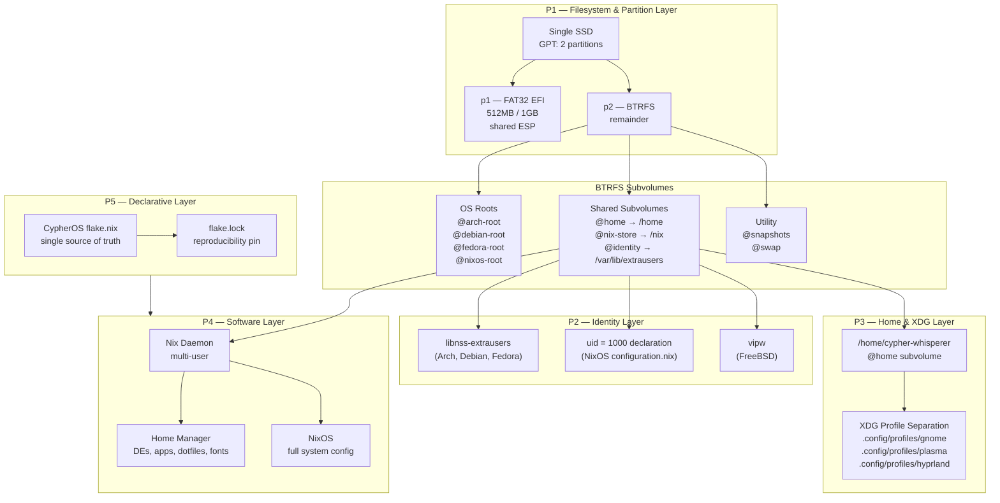

---

## Pillar 1 — Filesystem & Partition Layer

**Technology:** BTRFS on a single SSD, structured with subvolumes.

The partition table is deliberately minimal — exactly two partitions. All structural complexity lives inside the BTRFS layer as subvolumes, not as partitions. This is the key property that makes adding a new OS additive rather than disruptive: a new OS is a new subvolume, not a repartition.

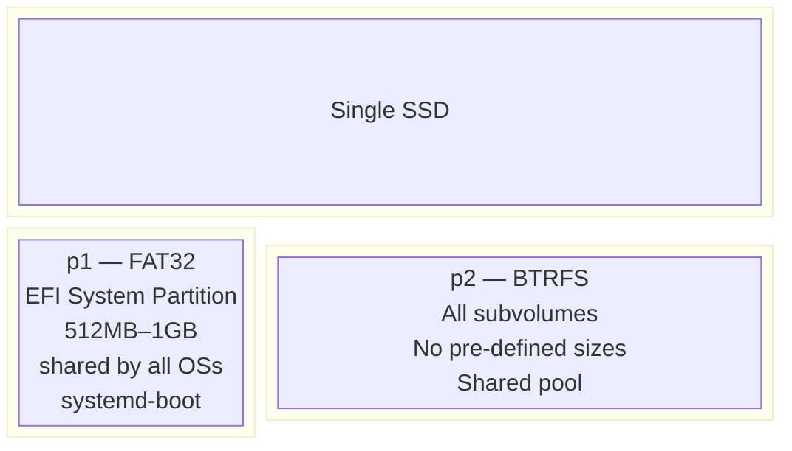

**Subvolume layout:**

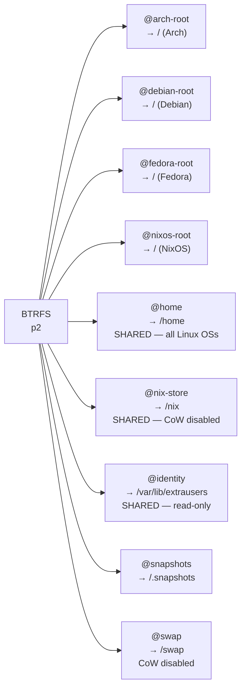

**Key constraints:**

- `@nix-store` — CoW disabled via `chattr +C` before first Nix write. BTRFS CoW and Nix hardlinks interact poorly without this.
- `@swap` — CoW disabled via `chattr +C`. A hard BTRFS requirement for swapfiles. The kernel refuses to activate swap on a CoW-enabled file.
- `@freebsd-root` — FreeBSD cannot natively mount BTRFS. Separate UFS/ZFS partition or best-effort compatibility layer. Resolved in Phase 10.
- Subvolumes share the BTRFS pool freely. No pre-defined sizes. No repartitioning to add an OS.

**Swap strategy:**

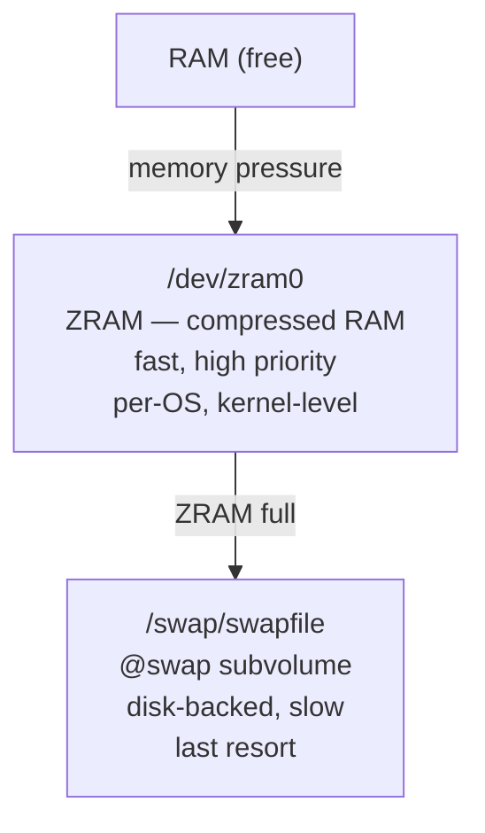

---

## Pillar 2 — Identity Layer

**Technology:** `libnss-extrausers` on Linux; explicit `uid = 1000` on NixOS; `vipw` on FreeBSD.

The load-bearing piece of the identity layer is UID consistency. File ownership on shared BTRFS subvolumes resolves by UID number, not by username string. Every OS must agree on `cypher-whisperer = UID 1000`.

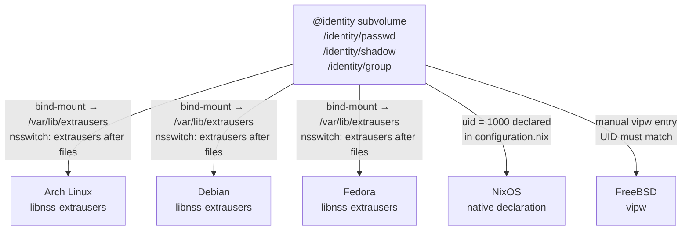

**Canonical identity record:**

```
# @identity/passwd
cypher-whisperer:x:1000:1000:Cypher Whisperer:/home/cypher-whisperer:/bin/zsh

# @identity/group
cypher-whisperer:x:1000:
wheel:x:998:cypher-whisperer
video:x:986:cypher-whisperer
audio:x:985:cypher-whisperer
```

**`systemd-homed` is explicitly out of scope.** It manages identity per-OS locally and enters an `unfixated` state when a user record exists on one OS but not another. It was never designed as a shared identity store. See [`docs/project/tech-stack.md`](https://claude.ai/chat/tech-stack.md) for the full reasoning.

---

## Pillar 3 — Home & XDG Profile Layer

**Technology:** Shared `@home` BTRFS subvolume + XDG environment variable overrides per DE session.

One home directory — `/home/cypher-whisperer` on `@home` — mounted by every Linux OS. All personal data (documents, projects, SSH keys, GPG keys) lives here and is always accessible regardless of which OS is booted.

**The DE conflict problem:** Running Hyprland and GNOME under the same `$HOME` without isolation causes fights over:

- `~/.config/mimeapps.list` — both DEs overwrite default app associations
- `~/.config/autostart/` — GNOME autostart entries fire in Hyprland sessions
- `~/.local/share/` — state files collide (recently-used, bookmarks)
- D-Bus session services — GNOME services (`gvfs`, `tracker`) do not coexist cleanly with non-Mutter compositors

**The solution — XDG Profile Separation:**

Each DE is launched via a Home Manager-managed wrapper script that overrides XDG base directories before exec-ing the session:

```bash
# ~/.local/bin/launch-gnome
export XDG_CONFIG_HOME="$HOME/.config/profiles/gnome"
export XDG_DATA_HOME="$HOME/.local/share/profiles/gnome"
export XDG_CACHE_HOME="$HOME/.cache/profiles/gnome"
export XDG_STATE_HOME="$HOME/.local/state/profiles/gnome"
exec gnome-session
```

Each launcher script is registered as a `.desktop` session entry with the display manager. The user selects the session at login — the DM shows each variant as a distinct choice.

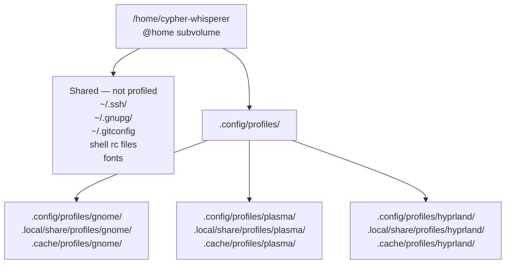

Intentionally not profiled (shared across all DE sessions): SSH keys, GPG keys, git config, shell rc files, fonts. Anything that does not cause DE conflicts stays generalized.

---

## Pillar 4 — Software Layer

**Technology:** Nix multi-user daemon + Home Manager on all OSs. NixOS gets full system Nix.

The boundary is clean: Nix owns everything _above_ the OS ABI. The native package manager owns everything _below_ it.

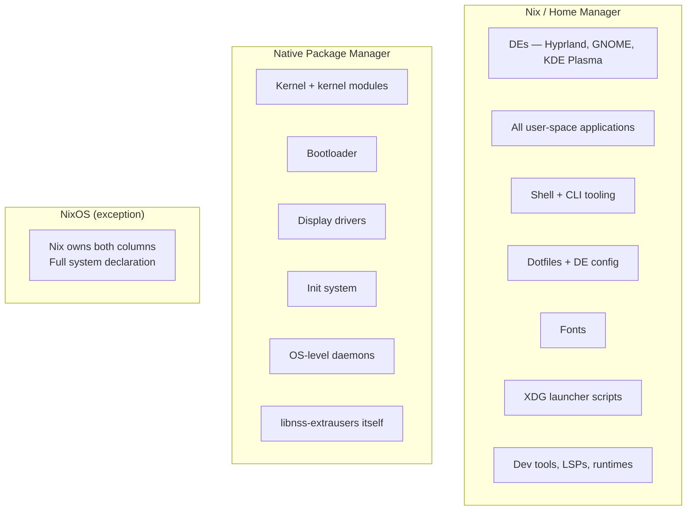

**Shared `@nix-store`:** Mounted at `/nix` by every OS that uses Nix. A package built once is available everywhere. Adding a second OS does not re-download or re-build anything already present in the store. `chattr +C` on the subvolume before the first Nix write is mandatory.

---

## Pillar 5 — Declarative & Dotfiles Layer

**Technology:** Nix Flakes + Home Manager modules in a git repository.

The `CypherOS` repository is the single source of truth. A fresh OS install plus `nixos-install --flake .#cypher-nixos` (or `home-manager switch --flake .#cypher-whisperer@arch`) reconstructs the full environment.

**`flake.nix` structure:**

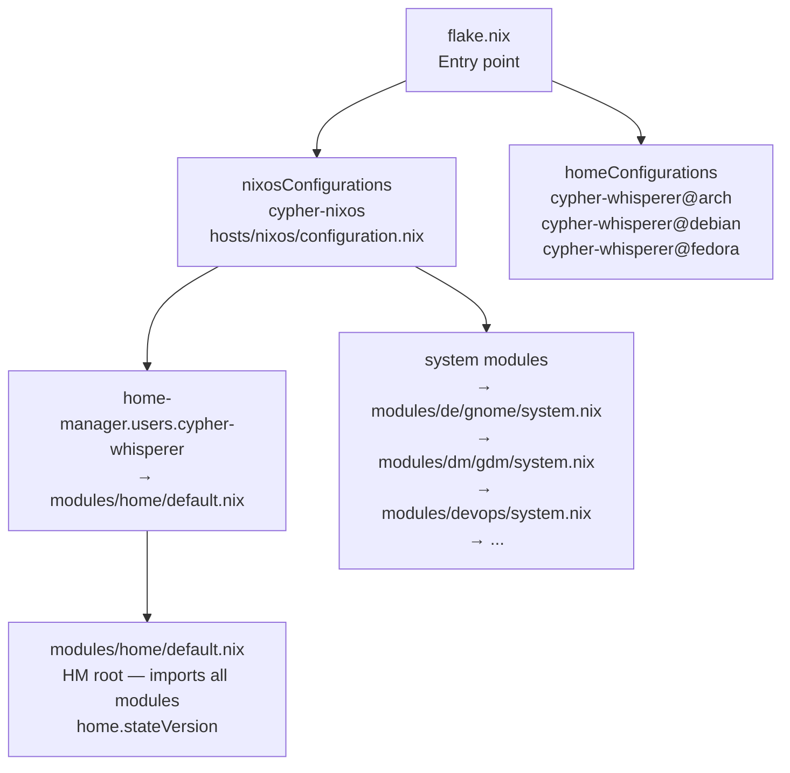

---

## Module Architecture — The `cypher-os` Namespace

All configuration options live under the `cypher-os` attribute tree. Every option you declare is a question CypherOS asks the host config: _"do you want this?"_

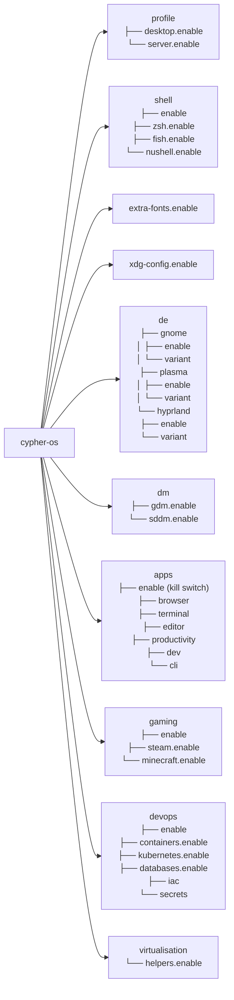

**Profile cascade:**

One line in `configuration.nix` activates the entire desktop stack:

```nix
cypher-os.profile.desktop.enable = true;
```

This cascades via `lib.mkDefault` through the module system:

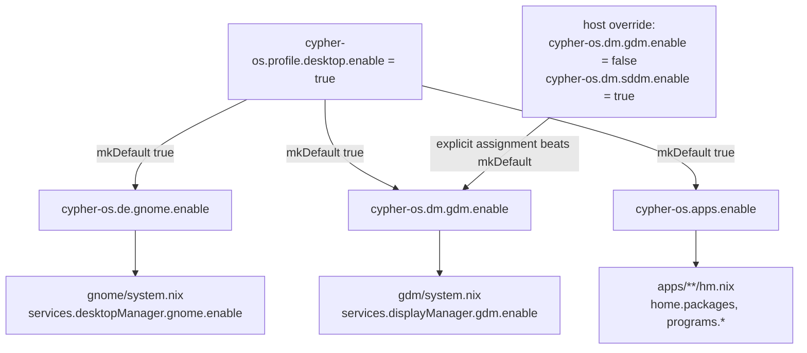

For the full module architecture specification, see [ADR-005 — Module Architecture](https://claude.ai/project/decisions/ADR-005-module-architecture.md).

---

## Integration Map

How the five pillars connect at runtime when booted into any Linux OS on the machine:

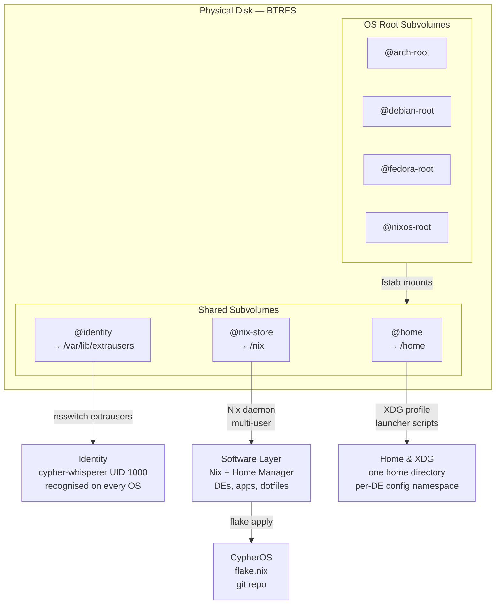

---

## Implementation Sequence

→ See [`ROADMAP.md`](https://claude.ai/ROADMAP.md) for the full phase breakdown with status tracking.

---

## Open Questions & Known Trade-offs

|#|Question|Status|
|---|---|---|
|OQ1|Nix daemon mode — single-user vs multi-user on non-NixOS|✅ Decided: multi-user on all OSs|
|OQ2|FreeBSD `@home` access — BTRFS incompatible|⊙ Phase 10 — likely exFAT/ext4 shared partition|
|OQ3|FreeBSD password hash format — yescrypt vs SHA-512|⊙ Phase 10 — sync script needed|
|OQ4|GNOME Keyring / KWallet isolation under XDG profiling|⊙ Verify Phase 7|
|OQ5|BTRFS CoW + Nix hardlinks|✅ `chattr +C` on `@nix-store` before Nix install|
|OQ6|Shared ESP + systemd-boot vs per-OS EFI|⊙ Decided Phase 0 — shared ESP + systemd-boot|
